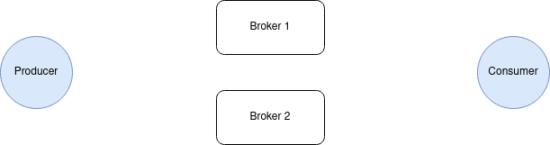
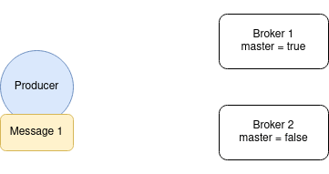

# Kitten MQ

Easy to learn, Secure, Business-ready, Resilient & Fast Message Queue system

## Philosophy and why

Most of systems (Kafka, RabbitMQ, ZeroMQ, NSQ, NATS, ...) are either too complex to use/deploy or too "low-level".
First mission: stay simple to learn, simple to use and simple to deploy.

We want a system
- which provides a beautiful admin dashboard
- where each client is authenticated with assymetric JWTs (no user/password to maintain for each client!)
- where it is easy to define who has the right to listen/send what

It follows this principle `one channel endpoint/version = one JSON format`

Kitten-MQ guarantees that a message will be delivered at least once, though duplicate messages are possible.
Consumers should expect this and de-dupe or perform idempotent operations.

## Features

- no SPF, master/slave broker
- authentication with assymetric pub/priv key
- automatic subscription of clients
- channel right management (optional), if `rules` is defined in broker config
- schema validation per channel (optional), if `channels` is defined in broker config


## Installation

```bash
  npm install kitten-mq --save
```

### Systemd

- Install

```
 cd /tmp
 curl https://raw.githubusercontent.com/Ideolys/kitten-mq/master/bin/install.sh | sudo bash
```

## Getting started

**1) Install and start a broker: a server that manage and distribute messages among clients**

> The broker creates a directory in `/var/www/kitten-mq` and its config file in `/var/www/kitten-mq/kitten-mq.config.json`.

```bash
  [sudo] npm install -g kitten-mq

  # On ubuntu, deploy as systemd service (PRODUCTION ENV)
  sudo $(npm root -g)/kitten-mq/bin/kittenMQ-systemctl

  # On OSX, of for debugging
  kitten-mq start
```

**2) Configure the broker and reload the configuration**

Adapt the configuration file for your needs `var/www/kitten-mq/kitten-mq.config.json` (cf. "Broker configuration" below )
and relaod configuration without restarting kitten-mq:

```bash
  kitten-mq reload
```

**3) Use it in your code on client side**

```bash
  npm i kitten-mq --save
```

```javascript
  let kittenMQ = require('kitten-mq');

  let config = {
    hosts         : [
      'mybrokerurl.com:443@serviceId#123456789' // list of brokers mirror URLs for High Avaibility
      // <url|ip>:<port>@<serviceId>#<private-token-of-broker>
    ],
    clientId      : 'easilys-APP-KEY'           // The client id, it must be globally unique
    keysDirectory : 'path_to_keys_directory',
    keysName      : 'key_name',
  };

  // When the client connects for the first time, it pushes the public key on the broker (subscription)
  // Then, the broker will accept connections for this client only if tokens are generated with the same pub/priv key
  let mq = kittenMQ.client();

  mq.connect(config, (err) => {
    // This callback is called only once
    console.log(err);
  });

  // Now, you are ready to send message to a specific channel
  // If the broker is not available, it will re-try automatically until the sending queue is full, then the callback is called with errors
  mq.send('endpoint/v1/120', 'coucou', (err) => {
    console.log(err);
  });

  // You can broadcast the message to all destination IDs of a channel
  mq.send('endpoint/v1/*', 'coucou', (err) => {
    console.log(err);
  });

  // You can listen channel, the message is sent to as many listeners as there are
  mq.listen('endpoint/v1/120', (err, msg) => {
    console.log(msg);
  });

  // Or consume channel, the message is sent to one consumer at a time (round-robin distribution)
  mq.consume('endpoint/v1/120', (err, msg, done, info) => {
    console.log(msg);
    done(false); // requeue if false is passed
    done(false, 1); // requeue with a delay of 1 second
  })

  // You can use wildcard to listen many channels, and aknowledge
  mq.listen('endpoint/v1/*', (err, msg, info) => {
    console.log(info.channel.endpoint);
    console.log(info.channel.version);
    console.log(info.channel.id);
    console.log(msg);
  });

  // you can also pass an object to describe the channel
  let _channel = {
    endpoint : 'endpoint',
    version : 'v1',
    ids : [123, 22, 33]
  };
  let listener = mq.listen(_channel, (msg) => {
    console.log(msg);
  });
  listener.addId(10, (err) => {}); // you can add id to listen at runtime
  listener.removeId(222, (err) => {}); // or remove id to listen at runtime

```

## Broker configuration

The broker must have a config file which defines client rights between channels

```javascript
{
  serverId              : 'mybroker-service-1',         // broker unique id, defined on the broker side
  registeredClientsPath : '/var/www/kitten-mq/clients',
  keysDirectory         : '/var/www/kitten-mq/keys',
  keysName              : '/var/www/kitten-mq/logs',
  isMaster              : true, // Only the Master is allowed to send messages to listeners and consumers
                                // Slaves receive messages and aknowledges

  socketServer : {
    port            : 1234, // server port
    host            : 'localhost',
    logs            : '/var/www/kitten-mq/packets',
    packetsFilename : 'broker.log', // name of the file to saved unsent packets
    token           : null          // auth token for clients. Example: aaaaaaa-bbbb-bbbb-bbbb-bbbbccccccc
  },

  maxItemsInQueue : 1000, // max item in queue in one queue (channel)
  requeueLimit    : 5,    // limit of requeues for one packet
  requeueInterval : 100   // requeue interval in seconds

  // OPTIONAL: Rights management of channels
  rules    : [
    {
      client        : 'easilys-*',                         // if * is used, it auto accepts new clients which match this client name (only easilys is concerned)
      read          : ['!invoice/*', 'public_message/*'],  // Syntax allowed are: "endpoint/version/id", "endpoint/version/*" or "endpoint/*"
                                                           // "!" means the client cannot listen on *. It must listen on a specific channel id
                                                           // for example "invoice/v1/my-supplier-id-my-ref". Then this channel is "reserved" for this client
                                                           // exclusively. Other clients cannot listen to the same channel.
      write         : ['email/*', 'faxes/*']
    },
    {
      client        : 'email-service-1',                   // the first client that connects with this name reserve the connection forever (pub/priv key associated).
                                                           // Then, a client with the same name can connect only if it has the same pub/priv key
      read          : ['email/*'],
      write         : ['invoice/*']
    }
  ],

  // OPTIONAL
  channels :  {
    'easilys/v1' : {
      prefetch : 1 // @optional number of unacknowledged messages @default 1
      ttl      : 1 // @optional time to live (in second) for messages in queue @default no ttl
      map      : {
        id : ['int'],
        ...
      }
    }
  }
}
```

## Statistics

The broker defines statistics at `GET /statistics` if config parameter `isManagementInterface` is set to `true`.

Available statistics are:

Name                                            | Description
------------------------------------------------|-------------
kitten_mq_info_uptime                           | Broker's uptime
kitten_mq_messages_sent_count                   | Number of messages sent to clients
kitten_mq_messages_sent_per_seconds_average     | Average of number of messages sent to clients per seconds
kitten_mq_messages_received_count               | Number of messages added to queues
kitten_mq_messages_received_per_seconds_average | Average of number of messages added to queues per seconds
kitten_mq_messages_acked_count                  | Number of messages acked
kitten_mq_messages_acked_per_seconds_average    | Average of number of messages acked per seconds
kitten_mq_queue_messages_count                  | Number of messages added to a queue
kitten_mq_queue_messages_dropped_count          | Number of messages dropped by a queue
kitten_mq_queue_messages_timeout_count          | Number of messages in timeout in a queue


## Concepts to learn

### What is a broker?

A broker is a server which receives message from clients and push them to other clients

### What is a channel?

Kitten-MQ works like a radio. There are channels where everyone (if allowed) can speak or listen to.

Channel names must follow this pattern : `endpoint/version/destination_id`

- `endpoint` can be any alphanumeric string without special characters (`-` are allowed), consider it like the beginning of a REST API
- `version`  defines the JSON format version `v1, v2, ...`
- `destination_id` can be any urlencoded string you want (at least `/` and `*` must be urlencoded)

One tuple `endpoint/v1` defines a JSON format


### What is the difference between mq.listen and mq.consume?

KittenMQ duplicates messages of a channel to as many listeners, but is there are multiple consumers for the same channel, only one
consumer will receive the message among other


### Reload the broker configuration

To reload the broker configuration: `kitten-mq reload`.

## How it works (broker) ?

### Publish

Kitten-mq broker is designed to work with several brokers.

A Kitten-mq client broadcasts a message to all brokers. Then, only one broker (master) is in charge of pushing the message to the corresponding listeners and/or consumers.
When the message reached the consumer / listener, it will broadcast to the brokers an acknowledge.



### Update a master broker

First, use the command `soft-stop` to gracefully shutdown the master broker.

Second, update the configuration of a second broker to define it as master.

Third, reload the configuration. The messages will start to be pushed to consumers and/or listeners.



Finally, you can update the old master broker and restart it. Be sure to not defined it as master.
